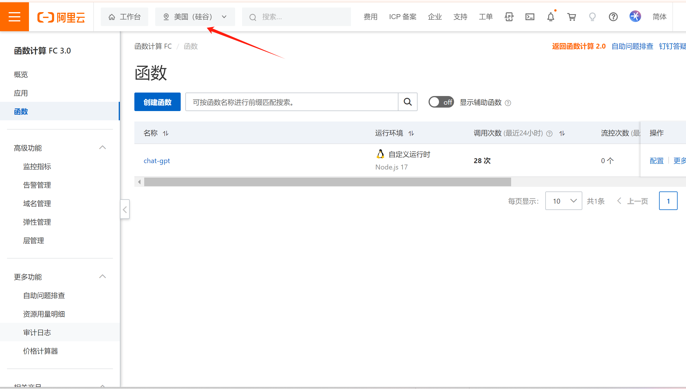

# 使用阿里云函数代理OpenAI

### 1.注册账号:[https://cn.aliyun.com/](https://cn.aliyun.com/) 

### 2.控制台：[https://fcnext.console.aliyun.com/overview](https://fcnext.console.aliyun.com/overview)

### 3.修改美国地区：

### 4、创建函数：

### 5、函数配置
- 创建函数方式：使用自定义运行时创建
- 基本设置：
    - 函数名称：
    - 请求处理程序类型：处理HTTP请求
- 函数代码
    - 运行环境：Nodejs 16.13（或者更高的版本）
    - 函数代码：上传下载好的源代码zip包
    - 启动命令：node app.js
    - 监听端口：9000
- 高级配置
    - vCPU：0.1 
    - 内存：64M
    - 硬盘大小：512
    - 实例并发度：2
    - 执行超时时间：900 
    - 时区：UTC
- 环境变量（不修改）
- 触发器配置（这里可能要创建一个新的触发器）：
    - 请求方法：ANY
    - 禁用公网访问：否
    - 认证方式：无需认证

### 6、获取url
创建函数后，查看函数详情，【触发器管理（URL）】中找到公网访问地址

